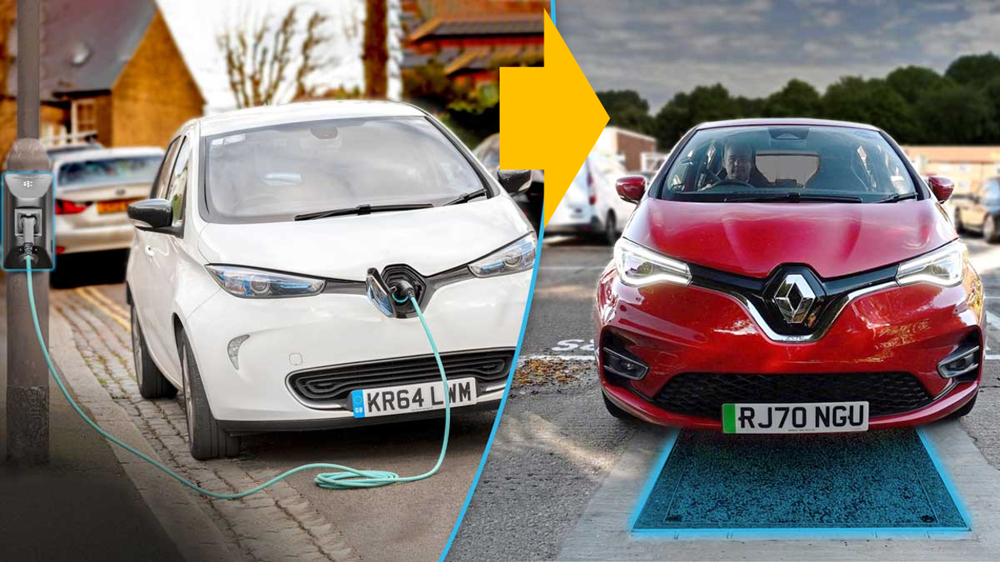
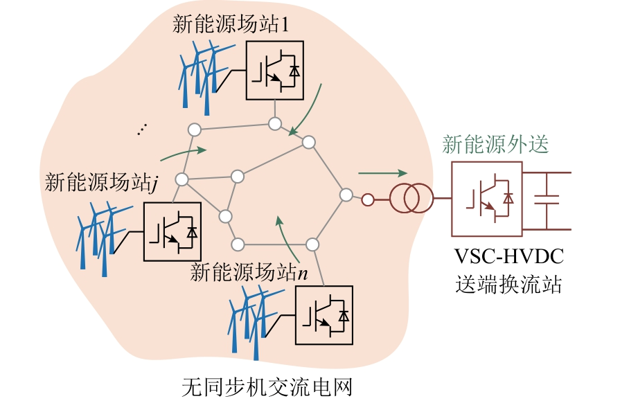
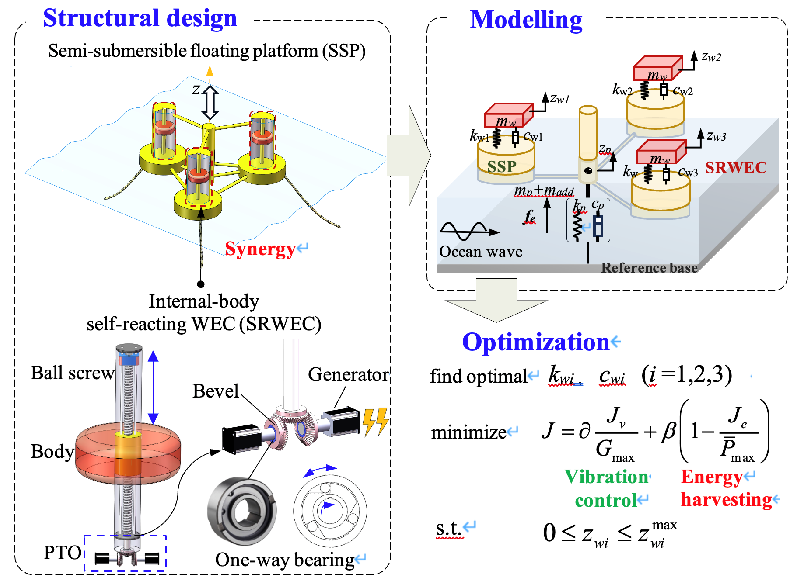

华南理工大学，吴贤铭智能工程学院，副教授（博导、特聘研究员），主要研究面向新能源汽车及新型电力系统的电力电子技术，目前主持国家级、省部级和校企合作项目20余项，合作主持1项中国澳门科学技术发展基金项目，作为主要完成人参与中国香港科研资助项目5项，以第一作者/通讯作者发表SCI论文27篇，入选中国科协战略发展部科技智库青年人才计划，获IEEE TPEL杰出审稿人奖、IEEE JETCAS最佳审稿人、IEEE APPEEC 2019会议最佳论文奖、IEEE PEAC 2022会议优秀论文奖、中国电源学会期刊邀稿，授权中美国专利1件和中国发明专利3件。
欢迎有志在新能源系统中寻找“双碳”目标答案的同学加入！（电气、控制、机械、电子、计算机等学科背景均可，欢迎电邮联系）

# Research area

<html lang="zh-CN">
<table style="margin-left: auto; margin-right: auto;">
    
    <tr>
        <td>
            <!--左侧内容-->
            
        </td>
        <td>
            <!--右侧内容-->
            
无线电能传输

            项目简介：针对电动汽车无线充电存在输出范围窄、传输效率低的问题，从电路、调制、建模和控制等方面展开研究，提出宽输出高效率无线充电新方法。此外，针对电动汽车“边走边充”所面临的技术挑战，研究基于多时间尺度的电动汽车动态无线充电系统关键控制技术。
        </td>
    </tr>
</table>
</html>

<html lang="zh-CN">
<table style="margin-left: auto; margin-right: auto;">
    
    <tr>
        <td>
            <!--左侧内容-->
            
        </td>
        <td>
            <!--右侧内容-->
            
大规模新能源场站的建模与仿真

            项目简介：建立准确的新能源场站模型是研究大规模新能源接入对电网影响的基础。从大规模新能源接入对系统功角稳定性、频率稳定性、电压稳定性、和电力电子多频段振荡角度出发，研究大规模电力系统仿真对新能源场站模型的需求，提取新能源场站模型对大规模电力系统仿真的关键影响因素，提出新能源场站等值模型。
        </td>
    </tr>
</table>
</html>

<html lang="zh-CN">
<table style="margin-left: auto; margin-right: auto;">
    
    <tr>
        <td>
            <!--左侧内容-->
            
        </td>
        <td>
            <!--右侧内容-->
            
波浪发电装置在中远海风电漂浮平台上的减震与发电应用

            项目简介：建立准确的新能源场站模型是研究大规模新能源接入对电网影响的基础。从大规模新能源接入对系统功角稳定性、频率稳定性、电压稳定性、和电力电子多频段振荡角度出发，研究大规模电力系统仿真对新能源场站模型的需求，提取新能源场站模型对大规模电力系统仿真的关键影响因素，提出新能源场站等值模型。
        </td>
    </tr>
</table>
</html>

# Publications
[32] Wenhua Ding, Yufei Wang, Tingyu Chen, Zhenghong Lu, Yue You, Jingyu Wang, and Zhicong Huang*, “A stacking machine-learning based method for accelerating magnetic coupler design with ferrite cores in inductive power transfer applications,” International Journal of Circuit Theory and Applications, to appear.

[31] Hai Xu, Zhicong Huang*, Xiaolu Lucia Li*, and Chi K. Tse, [“Misalignment-tolerant IPT coupler with enhanced magnetic flux variation suppression and reduced copper usage,”](https://ieeexplore.ieee.org/document/10494318)IEEE Transactions on Power Electronics, to appear.[(PDF)](/files/31.pdf) 

[30] Zhicong Huang*, Tian Qin, Xiaolu Lucia Li*, Li Ding, Herbert Ho-Ching Iu, and Chi K. Tse, [“Synthesis of inductive power transfer converters with dual immittance networks for inherent CC-to-CV charging profiles,”](https://ieeexplore.ieee.org/document/10480593)IEEE Transactions on Power Electronics, vol. 39, no. 6, pp. 7766-7777, Jun. 2024.[(PDF)](/files/30.pdf) 

[29] Bowei Zou and Zhicong Huang*, [“Primary-frequency-tuning and secondary-impedance-matching IPT converter with programmable constant power output and optimal efficiency tracking against variation of coupling coefficient,”](https://ieeexplore.ieee.org/document/10399825) IEEE Transactions on Power Electronics, vol. 39, no. 4, pp. 4895-4909, Apr. 2024.[(PDF)](/files/29.pdf) 

<html lang="zh-CN">

<a href="http://Gavy666.github.io/publications/">View More...</a> 

</html>
<!-- 超链接居右 -->

# Invention Patent

[1]   Wireless charging circuit and system（美国专利，US 11,201,503 B2）；

[2]   一种仿龙型飞行器（中国发明专利，ZL 2021 1 1498245.8）；

[3]   一种恒流恒压自主切换的无线充电系统（中国发明专利，ZL 2021 1 0398355.0）；

[4]   一种基于串联-串联补偿无线输电系统及均流方法（中国发明专利，ZL 2021 1 0631395.5）；

# Honors and Awards

[1]   2023年，ABB杯智能技术创新大赛（变频器半导体温度预测AI建模挑战赛）二等奖；

[2]   2022年，青蓝国际创新创业大赛初创组三等奖，“应用于自动导引车和新能源汽车的无线充电装置的研发及产业化”；

[3]   2022年，IEEE PEAC会议优秀论文奖；

[4]   2022年，入选中国科协战略发展部科技智库青年人才计划；

[5]   2021年，IEEE TPEL（电力电子领域权威期刊）杰出审稿人奖；

[6]   2019年，IEEE PES（电力与能源学会）APPEEC会议最佳论文奖；

[7]   2022年，第二届“率先杯”未来技术创新大赛初赛优胜奖，“用于出勤战车电能交互的模块化无线充放电装置”；

[8]   2020年，Outstanding Prize in Bank of China Trophy One Million Dollar Macao Regional Entrepreneurship Competition；

# News

  
 
<!-- 用于遍历某个文件夹中的所有文章 -->
